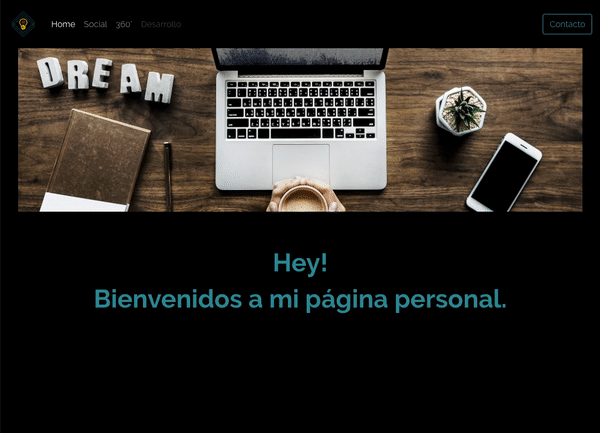

# Hola!
Este es mi primer proyecto serio, y todavía sigue en contrucción. 

#Lo puedes ver en https://aginert.github.io/ .

El objetivo era saber si era capaz de construir algo con todo lo que sabía.
Está inacabado por que seguí aprendiendo y formandome en otras cosas. 

Me sirvió para romper el hielo con proyectos reales, y para ser consciente de lo que sabía.
También fuí consciente, de que es mejor hacer cosas sencillas, adaptadas al nivel que tienes en ese momento.

Utilicé algunos elementos de codePen, con los que aprendí como se comporta CSS.

Próximamente, la renovaré utilizando REACT.

 

Gracias :)!

